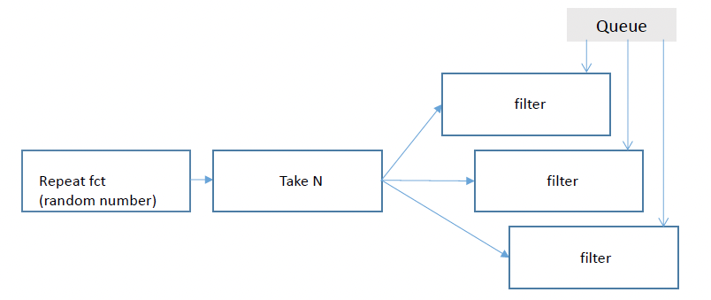

# CSI 2120A Notes, 2026Winter

Course code: CSI 2120 A00
Start Data: Jan 12, 2026
Note author: Jace Wang, *Uottawa*

## Assignments

### Assignment 1

#### Question 1 [ 4 Points ]

The following program computes the sum of the squares of a series of numbers in parallel, but it lacks the synchronization mechanisms to ensure a correct result. Use WaitGroup and Mutex to add the required synchronization

> 以下程序以并行方式计算一组数字的平方和，但由于缺少同步机制，计算结果可能不正确。请使用 WaitGroup 和 Mutex 对程序进行同步，使其能够正确运行。

``` go
package main

import (
    "fmt"
    "tims"
)

// concurrently computes the square sum
// without synchronization?!
func parallelsquareSum(numbers []int) int {
    sun := 0
    for _, n := range numbers {
        go func(n int) {
            sq := n * n
            tims.Sleep(500) // to simulate long compute tim
            sum += sq
        } (n)
    }
    return sum
}

func main() {
    nums := []int {2, 3, 4, 5, 6, 8, 11, 15, 32, 77}
    fmt.Println("Total:", parallelsquareSum(nums))
}
```

This program causes ==two== main problems:

1. **The main program exists too fast**`go func` is **asynchronous**.(`go func`的异步性). The `return sum` line in the main function runs **before** the Goroutines finish their calculations. The `sum` will likely still be 0.

2. **Race Condition**
   - A reads sum as 0.
   - B reads sum as 0.
   - A writes 4 (0+4).
   - B writes 9 (0+9).

The Result: B's 9 overwrites A's 4. The result is 9, but it should be 13.

==Solution==

```go
package main

import (
    "fmt"
    "sync" // 1. import sync package, we need WithGroup and Mutex
    "time"
)

func parallelSquareSum(numbers []int) int {
    sum := 0
    
    var wg sync.WaitGroup
    var mu sync.Mutex

    for _, n := range numbers {
        wg.Add(1)

        go fuinc(n int) {
            def wg.Done()

            sq := n * n

            time.Sleep(500 * time.Millisecond)

            mu.lock()

            sum += sq

            mu.Unlock()
        } (n)
    }
    wg.Wait()
    return sum
}

func main(){
    nums := []int{2, 3, 4, 5, 6, 8, 11, 15, 32, 77}
    fmt.Println("Total:", parallelSquareSum(nums))
}
```

#### Question 2

a) This code is a module that repeatedly ccalls a function. It stops when a message is sent to the `stop` channel. We want to add another stopping condition: the module should also terminate is its output channle is not read for a period of 2 seconds. *Hint: this can be done using `time.After` function*

> a) 此代码是一个模块，它会反复调用一个函数。当向停止通道发送消息时，该模块会停止运行。我们还想添加另一个停止条件：该模块还应在其输出通道未在 2 秒内被读取时终止运行。提示：这可以通过使用 `time.After` 函数来实现。

Code:

```go
func repearFct (wg *sync.WaitGroup, stop <- chan bool, fct func() int) <-chan int {
  intStram := make(chan int)
  
  go func() {
    defer func() {wg.Done()}()
    defer close(intStream)
    
    for {
      select {
      	case <-stop:
        	fmt.Printf("\nFin de repeat (%d)... \n", count)
        	return
        case intStream <- fct():
      }
    }
  }()
  return intStream
}
```

==Solution==: 最直接的办法就是在select方法中加入一个`tmie.After(2*time.Second)`，也就是只要两秒钟内一致发送无法成功，timeout就会触发并推出`goroutine`

```go
package main

import (
  "fmt"
  "sync"
  "time"
)

func repeatFct(wg *sync.WaitGroup, stop <-chan bool, fct func() int) <-chan int {
  intStream := make(chan int)

  wg.Add(1)
  go func() {
    // 确保 goroutine 退出时：1) WaitGroup 计数减 1，2) 关闭输出通道
    defer wg.Done()
    defer close(intStream)

    for {
      select {
        case <-stop:
        // 收到 stop 信号，立即退出
        fmt.Println("repeatFct: stopped by stop signal")
        return

        // 只有当“有人正在读取 intStream”时，这个发送分支才会被选中
        case intStream <- fct():
        // 成功发送一个值后继续循环
        // （这里不需要做额外处理）

        case <-time.After(2 * time.Second):
        // 2 秒内一直无法发送（通常意味着没人读 intStream），就退出
        fmt.Println("repeatFct: stopped because output not read for 2s")
        return
      }
    }
  }()

  return intStream
}
```

b) With the moudle in a), create a pipeline made of three concurrent stages that will generatee random *Harshad numbers*. A fan-out of three *Harshad filters* is applied at the last stage. Instead of sending the *Harshad numbers* to an output channel, the three filters insert the found numbers to a common queue data structure passed to each filter (see the signature below). Use this pipeline to generate 200 random numbers; only the Harshad numbers are inserted into the queue. Once the pipeline terminates, the content of the queue is displayed by the `main` function/

```go
func filter(wg *sync.WaitGroup, stop <- chan bool,
           inputIntstream <- chan int,
            filter func(int) bool,
           outputQueue *Queue)
```



==Solution==:

**Stage 1**：`repeatFct`（不断产生随机数，带 stop + 2s 输出无人读自动停止，来自 a)）

**Stage 2**：`takeN`（只取前 200 个随机数，然后触发 stop，让整个 pipeline 收敛结束）

**Stage 3**：`fan-out × 3 filters`（三个并发 Harshad filter，从同一个输入流读；**命中则写入同一个共享 Queue**，不再输出到 channel)

最后 `main` 等待所有 goroutine 结束，然后打印 Queue 内容

```go
package main

import (
	"fmt"
	"math/rand"
	"sync"
	"time"
)

// -------------------- Queue (thread-safe) --------------------

type Queue struct {
	mu   sync.Mutex
	data []int
}

// Enqueue 将一个元素加入队尾（加锁，避免多个 filter 并发写入导致 data race
func (q *Queue) Enqueue(x int) {
	q.mu.Lock()
	defer q.mu.Unlock()
	q.data = append(q.data, x)
}

// Snapshot 复制当前内容用于最后打印（避免打印时被并发修改）。
func (q *Queue) Snapshot() []int {
	q.mu.Lock()
	defer q.mu.Unlock()

	cp := make([]int, len(q.data))
	copy(cp, q.data)
	return cp
}

//
// -------------------- a) repeatFct (with 2s not-read stop) --------------------
//

// repeatFct 不断调用 fct() 生成 int 并尝试发送到输出通道。
// 停止条件：
// 1。 stop 通道收到信号
// 2。输出通道 2 秒都没有被读取（导致发送一直无法成功）
func repeatFct(wg *sync.WaitGroup, stop <-chan bool, fct func() int) <-chan int {
	intStream := make(chan int)

	wg.Add(1)
	go func() {
		defer wg.Done()
		defer close(intStream)

		for {
			select {
			case <-stop:
				// 外部请求停止
				return

			case intStream <- fct():
				// 成功发送一个值，继续循环
				// 注意：如果没人读，这个 case 不会被选中

			case <-time.After(2 * time.Second):
				// 2 秒内都无法完成发送（通常表示没人读），停止
				return
			}
		}
	}()

	return intStream
}

//
// -------------------- Stage 2: takeN --------------------
//

// takeN 从 input 读取最多 n 个数，并发送到输出。
// 当读取到 n 个后：
// - 关闭 output
// - 通过 stopOnce safely close(stopCh)，整个 pipeline stops
func takeN(
	wg *sync.WaitGroup,
	input <-chan int,
	n int,
	stopCh chan bool,
	stopOnce *sync.Once,
) <-chan int {
	out := make(chan int)

	wg.Add(1)
	go func() {
		defer wg.Done()
		defer close(out)

		count := 0
		for v := range input {
			out <- v
			count++
			if count >= n {
				stopOnce.Do(func() { close(stopCh) })
				return
			}
		}

		// 如果 input 提前关闭，避免 goroutine 虚空挂载
		stopOnce.Do(func() { close(stopCh) })
	}()

	return out
}

//
// -------------------- Stage 3: filter (fan-out x3) --------------------
//

// filter：从 inputIntStream 读取整数。
// 如果 filterFunc(v) 为真，把 v 放进 outputQueue。
func filter(
	wg *sync.WaitGroup,
	stop <-chan bool,
	inputIntStream <-chan int,
	filterFunc func(int) bool,
	outputQueue *Queue,
) {
	wg.Add(1)
	go func() {
		defer wg.Done()

		for {
			select {
			case <-stop:
				// 收到 stop，退出
				return

			case v, ok := <-inputIntStream:
				// 没有更多数据了，也退出
				if !ok {
					return
				}

				if filterFunc(v) {
					// 符合条件就写入共享队列
					outputQueue.Enqueue(v)
				}
			}
		}
	}()
}

//
// -------------------- Harshad helper --------------------
//

// sumDigits 计算十进制各位数字和
func sumDigits(n int) int {
	if n < 0 {
		n = -n
	}
	s := 0
	for n > 0 {
		s += n % 10
		n /= 10
	}
	return s
}

// isHarshad 判断是否 Harshad number
func isHarshad(n int) bool {
	if n <= 0 {
		return false
	}
	s := sumDigits(n)
	if s == 0 {
		return false
	}
	return n%s == 0
}

//
// -------------------- main: build pipeline --------------------
//

func main() {
	// WaitGroup 用来等待所有 goroutine 退出
	var wg sync.WaitGroup

	// stopCh 是全局停止信号（用 close(stopCh) 广播）
	stopCh := make(chan bool)

	// stopOnce 确保 stopCh 只会 close 一次，否则 panic
	var stopOnce sync.Once

	// 共享队列：三个 filter 都会往里写
	q := &Queue{}

	// 随机数种子（保证每次运行不一样）
	rand.Seed(time.Now().UnixNano())

	// Stage 1: repeatFct -> 产生随机数
	// 这里随机范围你可以按作业要求调整，我先给 1..1_000_000
	stage1 := repeatFct(&wg, stopCh, func() int {
		return rand.Intn(1_000_000) + 1
	})

	// Stage 2: takeN -> 只取 200 个随机数，然后触发 stop
	stage2 := takeN(&wg, stage1, 200, stopCh, &stopOnce)

	// Stage 3: fan-out 3 filters (concurrent)
	// 三个 filter 从同一个 stage2 输入流读，谁抢到算谁的（典型 fan-out）。
	filter(&wg, stopCh, stage2, isHarshad, q)
	filter(&wg, stopCh, stage2, isHarshad, q)
	filter(&wg, stopCh, stage2, isHarshad, q)

	// 等待所有 goroutine 结束
	wg.Wait()

	// 打印队列内容
	result := q.Snapshot()
	fmt.Printf("Total Harshad numbers found (from 200 random ints): %d\n", len(result))
	fmt.Println(result)
}

```

#### Question 3

The following function generates prime numbers that terminates by a given speccial pattern. A maximum number of trials is specified such that the function terminates even if the special prime cannot be found.

> 下面的函数生成以给定的特定模式结束的素数。指定一个最大试验次数，即使找不到特殊素数，函数也会终止。

```go
// a special prime is a prime number that ends
// with the specified pattern sequence
// after nTrials the function returns with a false error code
package main

import (
	"math"
	"math/rand"
)

func getSpecialPrime(pattern int64, maxValue int64, nTrials int) (int64, bool) {
	var div int64
	for div = 10; pattern/div != 0; div *= 10 {

	}
	for i := 0; i < nTrials; i++ {
		n := getPrime(maxValue)
		if n%div == pattern {
			return n, true // special prime found
		}
	}
	return 0, false // we failed to find a special prime
}

// checks if it is a prime number
func isPrime(v int64) bool {
	sq := int64(math.Sqrt(float64(v))) + 1
	var i int64
	for i = 2; i < sq; i++ {
		if v%i == 0 {
			return false
		}
	}
	return true
}

// returns a prime number
func getPrime(maxValue int64) int64 {
	for {
		n := rand.Int63n(maxValue)
		if isPrime(n) {
			return n
		}
	}
}

```

==Solution==:

```go
package main

import (
	"fmt"
	"math"
	"math/rand"
	"time"
)

// getSpecialPrime tries to find a "special prime":
// a prime number that ends with the decimal suffix "pattern".
// It tries at most nTrials times, then returns (0, false) if not found.
func getSpecialPrime(pattern int64, maxValue int64, nTrials int) (int64, bool) {
	// -------- Basic input validation (avoid nonsense cases) --------
	// pattern should be positive in this definition (suffix pattern).
	if pattern <= 0 {
		return 0, false
	}
	// maxValue must be large enough to generate primes.
	// If maxValue <= 2, there are no primes in [0, maxValue).
	if maxValue <= 2 {
		return 0, false
	}
	// If pattern is >= maxValue, you cannot find a number < maxValue
	// whose suffix equals pattern (because the whole number would need to be >= pattern).
	// (Strictly, a longer number could end with pattern, but it's still < maxValue,
	// so this is only impossible when maxValue is too small to allow suffix match.
	// We keep it as a conservative guard: if maxValue <= pattern, it's impossible.)
	if maxValue <= pattern {
		return 0, false
	}

	// -------- Compute div = 10^(number of digits of pattern) --------
	// Example: pattern=37 -> div=100; pattern=502 -> div=1000
	var div int64
	for div = 10; pattern/div != 0; div *= 10 {
		// empty body: we only update div
	}

	// -------- Try up to nTrials random primes --------
	for i := 0; i < nTrials; i++ {
		n := getPrime(maxValue)

		// Check if n ends with pattern (suffix match)
		if n%div == pattern {
			return n, true
		}
	}

	// Failed after nTrials attempts
	return 0, false
}

// isPrime checks whether v is a prime number.
//
// IMPORTANT FIX:
// - v < 2 is NOT prime.
// - Only test divisors up to sqrt(v).
func isPrime(v int64) bool {
	if v < 2 {
		return false
	}
	if v == 2 {
		return true
	}
	if v%2 == 0 {
		return false
	}

	// Only check odd divisors up to sqrt(v)
	sq := int64(math.Sqrt(float64(v)))
	for i := int64(3); i <= sq; i += 2 {
		if v%i == 0 {
			return false
		}
	}
	return true
}

// getPrime returns a random prime p such that 0 <= p < maxValue.
// It keeps sampling until it hits a prime.
func getPrime(maxValue int64) int64 {
	for {
		n := rand.Int63n(maxValue)
		if isPrime(n) {
			return n
		}
	}
}

func main() {
	// Seed the RNG so each run is different
	rand.Seed(time.Now().UnixNano())

	// Example parameters (you can change these in your report/testing)
	var (
		pattern  int64 = 37
		maxValue int64 = 1_000_000
		nTrials        = 100_000
	)

	n, ok := getSpecialPrime(pattern, maxValue, nTrials)
	if ok {
		fmt.Printf("Found special prime ending with %d: %d\n", pattern, n)
	} else {
		fmt.Printf("Failed to find a special prime ending with %d after %d trials.\n", pattern, nTrials)
	}
}

```

The function performs at most nTrials attempts. Each attempt generates a random integer in `[0, maxValue)` and keeps it only if it is prime. It then checks whether the last k decimal digits of the prime match the given pattern by using `n % 10^k == pattern`. If found, it returns `(n, true)`; otherwise, after nTrials it returns `(0, false)`.

---

## Labs

Submit one of three labs.

### Lab1

#### Question 1

Write a Go function that takes a parameter of type `float32` and returns two integer values. The **first integer** must be the floor value of the real number, and the **second integer** must be the ceciling value of that real number. Demonstrate that the function works correctly by calling it from a `main` function.

> 编写一个Go函数，接受float32类型的参数并返回两个整数值。**第一个整数**必须是实数的下限值，**第二个整数**必须是该实数的下限值。通过从“main”函数调用该函数来演示该函数的正确工作。

Solution:

```go
package main

import (
    "math"
)

func floorCeil32(x float32) ( int, int ) {
    xf := float64(x)

    floorVal := math.Floor(xf)
    ceilVal := math.Ceil(xf)

    return int(floorVal), int(ceilVal)
}
```

#### Question 2

 Write a function that removes all negative numbers from a slice of integers. The function must return a new slice containing only the *positive numbers*. Ensure that the returned slice has the same capacity as the original slice. Demonstrate that the function works correctly by calling it from a `main`function
> 编写一个函数，用于从整数切片中移除所有负数。该函数必须返回一个新的切片，其中仅包含*正数*。确保返回的切片与原始切片具有相同的容量。通过在 `main` 函数中调用该函数来证明该函数运行正常。

Solution:

```go
package main
// Haojian Wang
func keepPositives ( nums []int ) []int {
    result := make([]int, 0, cap(nums))

    for _, v := range nums {
        if v > 0 {
            result = append(result, v)
        }
    }
    return result
}
```

#### Question 3

Below is a binary tree containing instances of type `Point`, inserted in an arbitrary order (this is not a binary search tree).
I. Write a method that prints the contents of this tree using a post-order traversal.
II.Write a method `find(x, y)` that determins whether a given point is present anywhere in the tree.
III. Create an interface `PointSearcher` that specifies the `find` method.
IV. Test your methods using the `main` function on the next page, and ensure that your program produces the expected output shown.

> 给你一个不是 BST（插入顺序任意）的二叉树，节点里存 Point{x,y}。
> 你要实现四件事：
> I. postorder()：用后序遍历打印整棵树内容（Left → Right → Root）。  
> II. find(x,y)：在整棵树里查找是否存在该点（因为不是 BST，必须可能遍历左右子树）。
> III. 定义接口 PointSearcher：只规定 find(x,y) 方法。
> IV. 用题目给的 main 测试，并输出与示例一致。

Solution:

```go
package main

import "fmt"

type Point struct {
    x int
    y int
}

type PtTree struct {
    pt Point
    left, right *PtTree
}

func (t *PtTree) postorder() {
    if t == nil {
        return
    }

    t.left.postorder()

    t.right.postorder()

    fmt. Printf("(%d,%d) ", t.pt.x, t.pt.y)
}

func (t *PtTree) find(x, y int) bool{
    if t == nil {
        return false
    }

    if t.pt.x == x && t.pt.y == y{
        return true
    }

    return t.left.find(x, y) || t.right.find(x, y)
}

type PointSearcher interface{
    find(x, y int) bool
}
```

---

## Project

**Topic**: The stable marriage problem and the Resident Matching Service

This project totally has 4 parts need to be done.

1. Algorithm Logic
   1. Iterative(迭代法): Use standed Glae-Shapley algorithm. Residents will continully send requirements to first project. The project will decide accept or defuse by **Quota**(名额)
   2. Recursive(递归法): Likely McVitie-Wilson algorithm.
2. Data Input with Comma-Separated Values(CVS files)
   1. Residents(医师文件): Includes: ID, Name, and ROL(Rank Order List 偏好列表)
      - *Example*: `574, Salvatore, Williams," [NRS, HEP,MMI]"`
   2. Programs(项目文件): Includes: ID, Name, **Quota(名额)**, and ROL
      - *Example:* `MMI, Microbiology,1," [574,517,226,913,377,126]"`
3. Output Format
   1. 当程序结束，输出结果应该如下：
      - `lastname, firstname, residentID, programID, name`
   2. 另外还需要统计：为匹配的意识数量(Number of unmatched residents)和剩余的职位空缺(Number of positions available)

4. Language and Paradigms
   1. java and go

### Part 1 Java/OOP

Create the classes needed to solve the stable matching problem for residents and programs with the iterative Gale-Shapley algorithm. Your program must be a Java application called StableMatching that takes as input the names of the two csv files containing the rank order lists of the residents and the programs.
> 使用 迭代Gale-Shapley算法创建解决居民和项目稳定匹配问题所需的类。您的程序必须是一个名为StableMatching 的Java应用程序，它接受两个csv文件的名称作为输入，这两个文件包含居民和 程序的等级顺序列表

## Go Study

go语言为并发而生
主要结合课程内容进行go语言的学习，中英混合，默认已经掌握java，python以及部分C。如果需要更详细的笔记内容请参阅 [手册](https://www.topgoer.com/go%E5%9F%BA%E7%A1%80/)

### 1. Basics

Golang内置类型和函数
init函数和main函数
命令


#### 1.1 内置类型与函数

**值类型**:

```go
    bool
    int(32 or 64), int8, int16, int32, int64
    uint(32 or 64), uint8(byte), uint16, uint32, uint64
    float32, float64
    string
    complex64, complex128
    array    -- 固定长度的数组
```

**引用类型（pointer）**:

```go
    slice   -- 序列数组(最常用)
    map     -- 映射
    chan    -- 管道
```

**内置函数 inside functions**：

```go
    append          -- 用来追加元素到数组、slice中,返回修改后的数组、slice
    close           -- 主要用来关闭channel
    delete          -- 从map中删除key对应的value
    panic           -- 停止常规的goroutine  （panic和recover：用来做错误处理）
    recover         -- 允许程序定义goroutine的panic动作
    imag            -- 返回complex的实部   （complex、real imag：用于创建和操作复数）
    real            -- 返回complex的虚部
    make            -- 用来分配内存，返回Type本身(只能应用于slice, map, channel)
    new                -- 用来分配内存，主要用来分配值类型，比如int、struct。返回指向Type的指针
    cap             -- capacity是容量的意思，用于返回某个类型的最大容量（只能用于切片和 
    copy            -- 用于复制和连接slice，返回复制的数目
    len                -- 来求长度，比如string、array、slice、map、channel ，返回长度
    print、println     -- 底层打印函数，在部署环境中建议使用 fmt 包
```

**内置接口**：

```go
    type error interface { //只要实现了Error()函数，返回值为String的都实现了err接口

            Error()    String

    }
```

#### 1.2 Init函数和main函数

`init`函数 Function `init`

go语言中，`init`函数用于包package的初始化，该函数是go的一个特性。
特征如下：

> 1. init 函数是程序执行钱做包的初始化函数，例如包内部的变量等
> 2. 每个包里可以有 **多个** `init` 函数
> 3. 包的每个源文件也可以有多个`init`函数
> 4. 同一个包的`init`函数按照包导入的依赖关系决定该初始化函数的执行顺序
> 5. 不同包的`init`函数按照包导入依赖关系决定初始化函数的执行顺序
> 6. `init`函数不能被其他函数调用，而是在main函数执行前自动被调用

`main`函数

ex:

```go
package main

import "fmt"

func main() {
    //functions
}
```

#### 1.3 命令 commands

If you wanna run go in your terminal, you can check all the commands about go.

```bash
$go
Go is a tool for managing Go source code.

Usage:
    go command [arguments]

The commands are:

    build       compile packages and dependencies // 编译我们指定的远吗文件以及依赖包
    clean       remove object files // 删除执行其他命令时产生的一些文件和目录
    doc         show documentation for package or symbol
    env         print Go environment information // 打印go的环境信息
    bug         start a bug report
    fix         run go tool fix on packages
    fmt         run gofmt on package sources
    generate    generate Go files by processing source
    get         download and install packages and dependencies
    install     compile and install packages and dependencies
    list        list packages
    run         compile and run Go program
    test        test packages
    tool        run specified go tool
    version     print Go version
    vet         run go tool vet on packages // 检查go远吗中静态错误

Use "go help [command]" for more information about a command.

Additional help topices:

    c           calling between Go and C
    buildmode   description of build modes
    filetype    file types
    gopath      GOPATH environment variable
    environment environment variables
    importpath  import path syntax
    packages    description of package lists
    testflag    description of testing flags
    testfunc    description of testing functions

Use "go help [topic]" for more information about that topic.
```

### 2. In class Lecture Notes

A small Go program

```go
package main

import "fmt" // import a package
func main() {
    fmt.Println("Hello, 世界")
}
```

call a value:

```go
package main

import "fmt"

// 全局变量，并且只能用var关键词定义
// 全局变量不受是否“被用”限制
var program = "go"

func main() {
    // 先声明
    var name string
    // 再赋值
    name = "Tom"
    fmt.Println(name)

    // 声明属性并赋值
    var age int = 24
    // 直接赋值
    var gan = "man"
    fmt.Println(age, gan)

    // 声明并赋值
    yearOfNow := "2026"
    fmt.Println(yearOfNow)
}

```

Multiple return values:

```go
package main

import "fmt"

func main() {

    var s int
    var d int

    s, d = plusminus(7, 9)
    fmt.Printf("result = %d et %d", s, d)

    for i,j := 1,5 ; j < 100 ; i,j = i + 1, j + 5 {
        fmt.Printf("%d and %d", i, j)
    
    }
}
```
